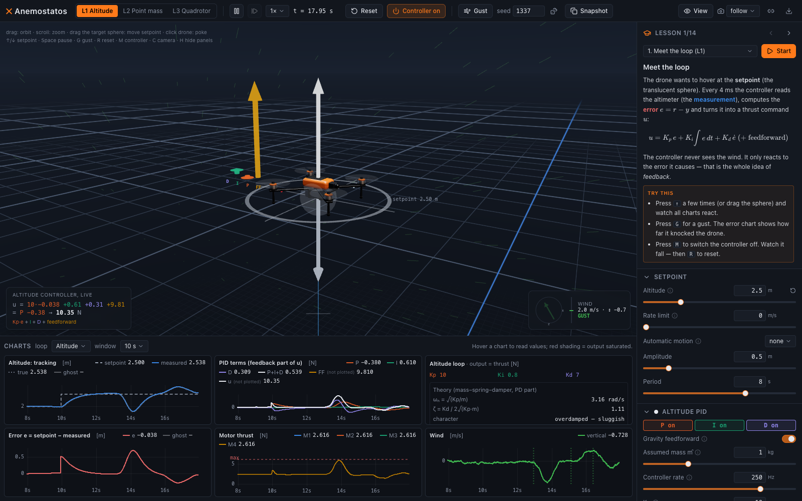
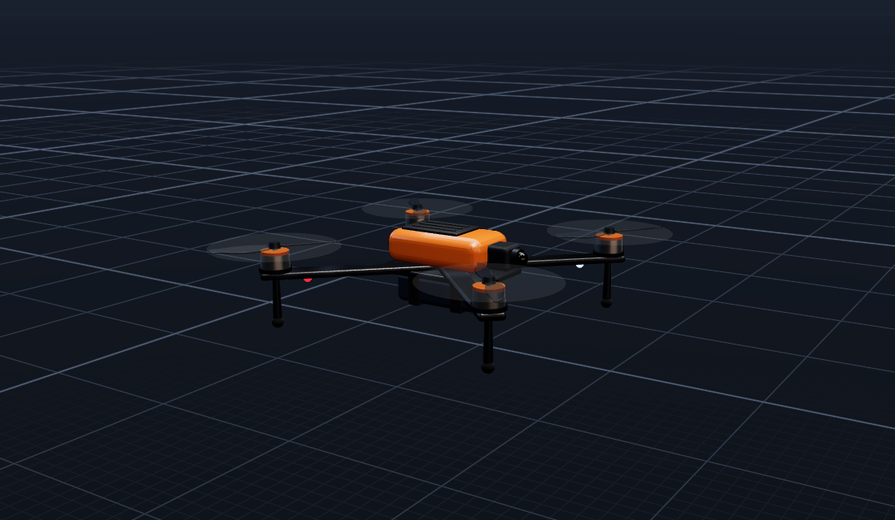
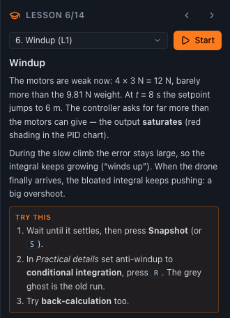
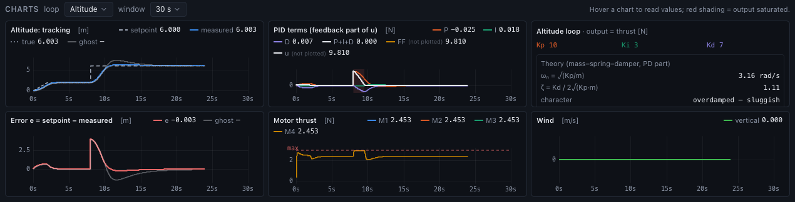
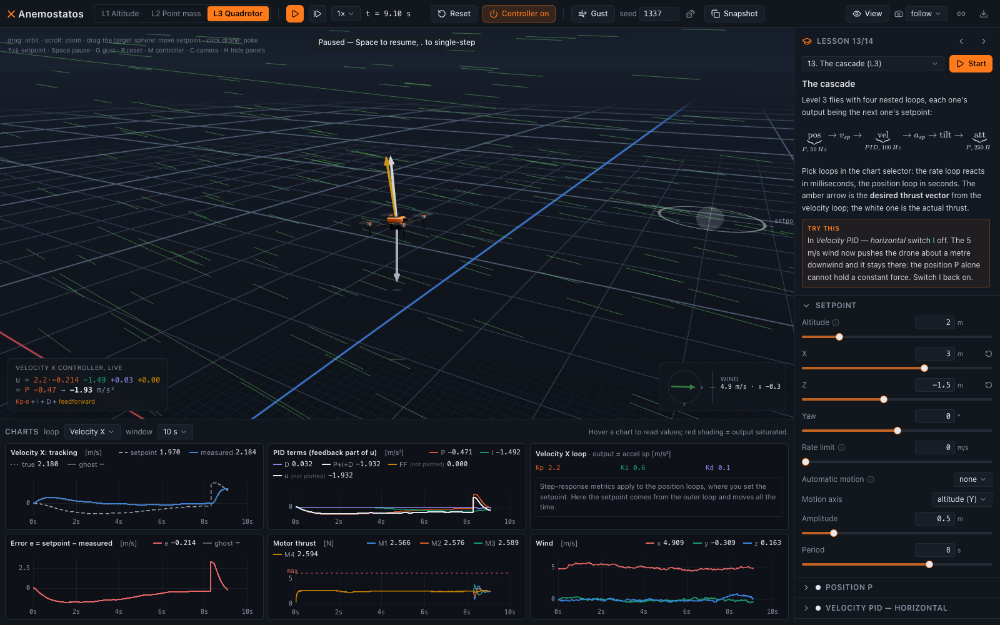

<h1 align="center">✕ Anemostatos</h1>

<p align="center">
  <b>A PID controller you can watch think.</b><br/>
  An interactive 3D simulator for really understanding PID control:<br/>
  a quadcopter fights gravity and gusty wind while every term of its controller is plotted live.
</p>

<p align="center">
  <i>ánemos</i> (wind) + <i>statós</i> (standing) — “the one that stands in the wind”
</p>



<p align="center"><sub>A downward gust (green, bottom right) knocks the drone off its 2.5 m setpoint. The P, I and D terms react (top middle), the motors throttle up (bottom middle), and the live formula (bottom left of the 3D view) shows the numbers being added.</sub></p>

---

## Why

Most PID explanations stop at the formula

$$u = K_p\,e + K_i \int e\,dt + K_d\,\dot e$$

and a few static step-response plots. Anemostatos lets you _feel_ it. Switch a
term off and watch the drone sag. Crank up a gain and see the oscillation
grow. Add sensor noise and watch the D term go haywire. Every force, every
term and every practical detail is visible, adjustable and plotted:
sampling rate, actuator saturation, integrator windup, derivative kick,
motor lag.

## Features

- **Three levels of fidelity**

  | Level             | Plant                                  | Controller                                                         |
  | ----------------- | -------------------------------------- | ------------------------------------------------------------------ |
  | **L1 Altitude**   | the drone moves only up and down       | one PID on height: the cleanest place to learn                     |
  | **L2 Point mass** | 3D point mass pushed by a force vector | three independent PIDs, one per axis                               |
  | **L3 Quadrotor**  | full 6-DoF rigid body with four motors | a real cascade: position → velocity → attitude → body rate → mixer |

- **A PID that shows its work.** Each term (P, I, D, feedforward) is recorded
  separately, drawn as its own arrow on the drone and plotted in its own colour.
  Red shading marks the moments when the output is saturated.
- **The practical stuff real controllers need:**
  - every term can be switched on and off;
  - D can act on the error or on the measurement;
  - a low-pass filter on D;
  - four anti-windup strategies;
  - a configurable controller rate;
  - gravity feedforward with a (possibly wrong) assumed mass.
- **Honest physics.** The model steps at 1 kHz and includes:
  - motor lag and quadratic drag relative to the air;
  - a wind model made of a mean wind, Ornstein–Uhlenbeck turbulence and "1 − cos" gusts;
  - sensor noise, bias and delay;
  - ground contact that can crash the drone.
- **Reproducible experiments.** All randomness comes from a seed. The same
  seed gives the same wind, so you can compare two tunings fairly. Snapshot
  a run and it stays on the charts as a grey **ghost** trace.
- **Theory next to practice.**
  - The info card shows the natural frequency ωₙ, the damping ratio ζ and the predicted steady-state error for your gains.
  - The measured rise time, overshoot, settling time and steady-state error sit right beside them.
- **14 guided lessons** with scripted events and goals, from "meet the loop"
  to "cascade inversion". One of them is a gust challenge scored against the
  default tune.
- **A good-looking scene.**
  - A procedural quadcopter with spinning props that blur into discs.
  - An infinite shader grid with a 0.1 / 1 / 5 m scale.
  - Height aids, wind tracers and a draggable setpoint.

<table>
  <tr>
    <td width="62%"></td>
    <td></td>
  </tr>
  <tr>
    <td><sub>The drone model is built in code from Three.js primitives: carbon arms, motor bells, two-blade props that blur into discs as they speed up, and LEDs showing front (white) and rear (red).</sub></td>
    <td><sub>Lessons explain one idea at a time, load their own setup and suggest experiments.</sub></td>
  </tr>
</table>

### Compare runs: integrator windup



<sub>Lesson 6. The motors are weak (12 N for a 9.81 N drone) and the setpoint jumps from 2 m to 6 m. The <b>grey ghost</b> is the run without anti-windup: during the saturated climb the integral winds up and the drone overshoots. The <b>blue</b> run uses conditional integration and arrives cleanly on the same seeded wind.</sub>

### The full cascade



<sub>Level 3 in a 5 m/s wind. The amber arrow is the thrust vector the velocity loop <i>wants</i>; the white arrow is what the tilted drone actually produces. The charts show the horizontal velocity loop. Any of the 12 loops in the cascade can be inspected and retuned live.</sub>

## The lessons

| #   | Lesson                 | Level | What you learn                                                         |
| --- | ---------------------- | ----- | ---------------------------------------------------------------------- |
| 1   | Meet the loop          | L1    | setpoint, measurement, error, output; what happens without feedback    |
| 2   | Just a spring          | L1    | P alone is a spring and it oscillates forever: ωₙ = √(Kp/m)            |
| 3   | The gravity droop      | L1    | without feedforward or I, P leaves an error e = mg/Kp                  |
| 4   | Add a damper           | L1    | D as a shock absorber; critical damping (goal: < 2 % overshoot)        |
| 5   | Integral to the rescue | L1    | I removes steady-state error, and why it _must_ overshoot              |
| 6   | Windup                 | L1    | saturation + integral = overshoot; anti-windup strategies compared     |
| 7   | Derivative kick        | L1    | D on error vs D on measurement                                         |
| 8   | Noisy sensor           | L1    | D amplifies noise; the filter trade-off                                |
| 9   | Too slow to react      | L1    | sampling rate and delay eat stability                                  |
| 10  | Find the edge          | L1    | stability limits, and why Ziegler–Nichols doesn't fit a hovering drone |
| 11  | Gust challenge         | L1    | beat the default tune on identical wind                                |
| 12  | Why drones tilt        | L2    | independent axis PIDs; the I term holding a steady wind                |
| 13  | The cascade            | L3    | nested loops, each one's output is the next one's setpoint             |
| 14  | Cascade inversion      | L3    | inner loops must be faster than outer ones                             |

## Run it

The simulator runs locally in the browser. It needs Node.js ≥ 20 and a
WebGL-capable browser.

```sh
git clone https://github.com/wojciech-stelmaszewski/anemostatos.git
cd anemostatos
make dev        # installs dependencies on first run, opens http://localhost:5173
```

| Target                        | What it does                                          |
| ----------------------------- | ----------------------------------------------------- |
| `make dev`                    | start the simulator with hot reload                   |
| `make check`                  | lint + typecheck + unit tests                         |
| `make test`                   | unit tests only (physics, PID, closed loops, lessons) |
| `make build` / `make preview` | production build and a local preview of it            |
| `make`                        | list all targets                                      |

## Controls

| Input                  | Action                                          |
| ---------------------- | ----------------------------------------------- |
| drag / scroll          | orbit / zoom the camera                         |
| drag the target sphere | move the setpoint (Shift: vertically, in L2/L3) |
| click the drone        | give it a shove                                 |
| `↑` / `↓`              | setpoint ±0.1 m (Shift: ±1 m)                   |
| `Space` / `.`          | pause / single-step one controller period       |
| `G`                    | trigger a gust                                  |
| `S`                    | snapshot the run as a ghost trace               |
| `M`                    | controller on/off                               |
| `R`                    | reset the run                                   |
| `1` `2` `3`            | simulation level                                |
| `C` / `H`              | cycle camera mode / hide panels                 |

Every parameter has a tooltip explaining what it does. **Copy link** in the
toolbar puts the entire parameter set into the URL, and **Download** exports
the last 60 s of telemetry as CSV.

## How it works

```
 React UI (panels, charts)      React Three Fiber (3D scene)
          │  params (Zustand)            │  reads state every frame (refs, no re-renders)
          ▼                              ▼
 ┌──────────────────────── engine ────────────────────────┐
 │  fixed 1 kHz step · telemetry ring buffers · metrics   │
 │    ┌──────── control ────────┐   ┌──────── sim ──────┐ │
 │    │ PID · altitude · point  │ → │ dynamics · wind   │ │
 │    │ mass · cascade · mixer  │ ← │ sensors · ground  │ │
 │    └─────────────────────────┘   └───────────────────┘ │
 └─────────────────────────────────────────────────────────┘
          framework-free TypeScript, unit-tested in Node
```

- The simulation core (`src/sim`, `src/control`, `src/engine`, `src/math`)
  is plain TypeScript with no React, Three.js or DOM, which lint enforces.
  That is why the physics and control code can be tested thoroughly.
- React renders structure, not frames. The scene updates through refs
  inside `useFrame`, and the uPlot charts redraw imperatively from
  telemetry ring buffers, so 60 fps never goes through React state.
- Stack: TypeScript, Vite, React 19, React Three Fiber + drei, Zustand,
  Radix/shadcn-style components with Tailwind, uPlot, KaTeX, Vitest.

## Documentation

The [`docs/`](docs/README.md) folder is the project's textbook and design record:

- [**PID primer**](docs/pid-primer.md): theory from the ground up, the digital PID, windup, derivative kick, noise, tuning, cascades.
- [**Physics model**](docs/physics-model.md): frames, equations of motion, motors, drag, the wind and gust model, integration.
- [**Control architecture**](docs/control-architecture.md): how the loops are wired at each level, including the cascade and the mixer.
- [**Software architecture**](docs/software-architecture.md): modules, the simulation loop, telemetry, testing.
- [**UI and visualization**](docs/ui-and-visualization.md): the scene, overlays, charts and lessons.
- [**Roadmap**](docs/roadmap.md): milestones and ideas for later, such as Bode plots, a relay auto-tuner and twin drones.

## License

[MIT](LICENSE) © 2026 Wojciech Stelmaszewski
