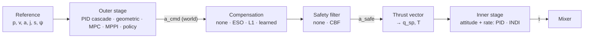

# Part II — Beyond PID

> **Status (2026-09-28):** Part II is complete — M7–M12 implemented, lessons II.1–II.21.
> Measured arena results: [arena.md](arena.md).
> Milestones in [roadmap.md](roadmap.md) point here.

Part I (lessons I.1–I.14) teaches PID from first principles up to the full
quadrotor cascade. Part II answers the question every student asks next:
**"what do people actually fly today, and why?"** It adds the controller
families that dominate current research and advanced autopilots, each one
introduced through a problem that PID visibly struggles with.

This lifts the "no advanced control" non-goal from
[README.md](README.md#non-goals). The other non-goals stand: the world stays
a grid, the controller always flies.

## 1. Research: the contemporary landscape

What the state of the art looks like in 2025–2026, focusing on multirotors.

| Family                                                           | What it is                                                                                                                                                                 | Where it stands today                                                                                                                                                                                                                                                                                                       | Fit for Anemostatos                                                                                                 |
| ---------------------------------------------------------------- | -------------------------------------------------------------------------------------------------------------------------------------------------------------------------- | --------------------------------------------------------------------------------------------------------------------------------------------------------------------------------------------------------------------------------------------------------------------------------------------------------------------------- | ------------------------------------------------------------------------------------------------------------------- |
| **Cascaded PID**                                                 | What we have.                                                                                                                                                              | Still the production default: PX4 and ArduPilot fly PID cascades [PX4]. The baseline every paper compares against.                                                                                                                                                                                                          | Done (Part I).                                                                                                      |
| **LQR / LQI**                                                    | Optimal linear state feedback from a quadratic cost.                                                                                                                       | Not "new", but the conceptual bridge to everything model-based: gains come from a model and a cost, not from knobs.                                                                                                                                                                                                         | **Yes** — cheap, exact on L1, explains PD as state feedback.                                                        |
| **Kalman filtering**                                             | Optimal state estimation fusing a model and noisy sensors.                                                                                                                 | Universal (every autopilot runs an EKF). A prerequisite for observers, INDI and MPC.                                                                                                                                                                                                                                        | **Yes** — L1 altimeter + accelerometer fusion.                                                                      |
| **ADRC / extended state observer**                               | Lump every unknown (mass error, wind, drag) into one "total disturbance", estimate it with an observer, cancel it [Han 2009, Gao 2003].                                    | Widely used in industry (motion control, drives) and a large body of UAV papers. One tuning knob: bandwidth.                                                                                                                                                                                                                | **Yes** — best "disturbance-observer" lesson; the sim knows the true disturbance, so we can plot estimate vs truth. |
| **INDI** (incremental nonlinear dynamic inversion)               | Replace the model of the vehicle by _measurements_ of its current acceleration; command only the increment [Smeur 2016, Smeur 2018].                                       | The research standard inner loop for agile and fault-tolerant flight (Paparazzi, TU Delft, MIT [Tal 2021], UZH Agilicious [Foehn 2022]). Sun et al. found an INDI inner loop is what makes both NMPC and flatness control robust [Sun 2022].                                                                                | **Yes, central.** Needs an accelerometer and motor-speed feedback in our sensor model.                              |
| **Geometric control on SO(3)/SE(3)** + tilt-prioritised attitude | Controllers defined on the rotation group itself: no Euler singularities, almost-global stability [Lee 2010, Brescianini 2020].                                            | The standard nonlinear tracking controller in research; the "GC" baseline of RL comparisons [Kunapuli 2025].                                                                                                                                                                                                                | **Yes** — large-angle recovery, full trajectory tracking.                                                           |
| **Differential flatness + min-snap trajectories**                | Position and yaw determine the whole state and inputs, so a smooth reference gives exact feedforward for attitude, body rates and torques [Mellinger 2011, Faessler 2018]. | Standard for aggressive trajectory tracking; the "DFBC" contender in [Sun 2022].                                                                                                                                                                                                                                            | **Yes** — pairs with geometric control.                                                                             |
| **Linear / nonlinear MPC**                                       | Optimise the next N inputs over a model, apply the first, repeat. Handles constraints explicitly.                                                                          | NMPC (acados [Verschueren 2022]) is state of the art for agile tracking at the physical limits [Sun 2022]; adaptive and data-driven variants [Hanover 2022, Torrente 2021].                                                                                                                                                 | **Yes** — linear MPC with an in-house QP; full NMPC only as a stretch goal (iLQR).                                  |
| **MPPI** (sampling-based MPC)                                    | Sample thousands of noisy input sequences, roll them out, average them weighted by cost [Williams 2017].                                                                   | Popular again for non-convex costs and reference-free racing [Zhao 2025]. Embarrassingly parallel.                                                                                                                                                                                                                          | **Yes** — trivial to implement, and its sampled futures are _the_ most visual thing we could draw.                  |
| **Control barrier functions**                                    | A minimal-change safety filter on top of any controller: stay in a safe set [Ames 2019].                                                                                   | The dominant modern tool for provable safety (geofences, collision avoidance).                                                                                                                                                                                                                                              | **Yes** — closed-form for one constraint; works on top of every other controller.                                   |
| **L1 adaptive control**                                          | Fast adaptation with a low-pass filter that decouples adaptation speed from robustness [Hovakimyan 2010].                                                                  | Mature; L1 augmentation of geometric control is a common strong baseline [Wu 2025].                                                                                                                                                                                                                                         | **Yes** — payload changes and motor degradation.                                                                    |
| **Learned-basis adaptive control (Neural-Fly)**                  | Meta-learn a feature map of the aerodynamic residual offline, adapt only its linear coefficients online [O'Connell 2022].                                                  | Beat nonlinear, L1 and INDI baselines in strong wind [O'Connell 2022]. Representative of "learning + control theory" hybrids.                                                                                                                                                                                               | **Yes, simplified** — hand-crafted features first, learned ones as a stretch.                                       |
| **Deep RL / differentiable-sim policies**                        | A neural network maps state to commands, trained in simulation.                                                                                                            | Champion-level racing [Kaufmann 2023]; beats optimal control at the limit of the envelope [Song 2023]. Differentiable simulation trains low-level policies in seconds [Heeg 2025]. Careful comparisons show the gap to geometric control is smaller than claimed: RL wins transients, GC wins steady state [Kunapuli 2025]. | **Yes, as a capstone** — a small policy trained offline against our own simulator, shown with its failure modes.    |
| Sliding mode, backstepping, H∞/μ-synthesis                       | Classical robust nonlinear/linear designs.                                                                                                                                 | Many papers, little adoption in flight stacks; H∞ lives in the frequency domain, which we don't visualise.                                                                                                                                                                                                                  | **No** (maybe one optional SMC "chattering" lesson later).                                                          |
| GP-MPC, Koopman, foundation-model control                        | Data-driven models inside MPC; lifted linear models; large pretrained policies.                                                                                            | Active research, no consensus yet.                                                                                                                                                                                                                                                                                          | **No** — mentioned in the primer's "further reading".                                                               |

**Takeaways that shape the plan**

1. There is no single winner. The honest message of current literature
   [Sun 2022, Song 2023, Kunapuli 2025] is that each family wins a
   different scenario. Part II therefore ends with an **arena** that
   benchmarks every controller on the same seeded scenarios.
2. Modern stacks are **hierarchies**, not monoliths: an outer planner/MPC
   producing accelerations or thrust + rates, an INDI or PID inner loop,
   optionally a safety filter. Our L3 controller becomes a set of
   **swappable stages** so students can mix and match.
3. The simulator knows the ground truth (true disturbance force, true mass,
   true inertia). Plotting an **estimate next to the truth** is something no
   real flight log can do — it is the pedagogical superpower of Part II.

## 2. The pedagogical arc

Each chapter starts with a failure of what the student already knows.

| Chapter                                          | The PID problem it answers                                                           | New ideas                                              |
| ------------------------------------------------ | ------------------------------------------------------------------------------------ | ------------------------------------------------------ |
| A. From knobs to models (L1)                     | "Three gains, tuned by trial and error — is there a principled way?"                 | State, state feedback, LQR/LQI, Kalman filter          |
| B. Estimate the disturbance, cancel it (L1 → L3) | "The I term is slow, and it only sees disturbances after they cause an error."       | ESO/ADRC, INDI, sensor-based control, filter sync      |
| C. Geometry and trajectories (L3)                | "The drone lags behind a moving setpoint and misbehaves upside down."                | SO(3), feedforward from flatness, min-snap             |
| D. Optimisation in the loop (L1, L3)             | "Saturation and limits are handled after the fact (anti-windup), never planned for." | MPC, horizons, compute budgets, MPPI, safety filters   |
| E. Adapting and learning (L1, L3)                | "What if the vehicle itself changes, or we can't write the model down?"              | L1 adaptive, learned features, learned policies, arena |

## 3. Architecture changes

All of it respects [software-architecture.md](software-architecture.md):
`sim/`, `control/`, `estimation/` and `math/` stay framework-free and
deterministic.

### 3.1 Generic loop signals (replaces PID-only `PidTerms` in the inspector)

`Controller.loops()` currently returns `PidTerms` (p/i/d/ff). New controllers
have different contributions (LQR: $-k_1 e_y$, $-k_2 v$, $-k_3 \xi$;
ADRC: $-\hat f / b_0$; INDI: $u_0$ + increment). Introduce:

```ts
interface LoopTerms {
  setpoint: number;
  measurement: number;
  error: number;
  /** Named additive contributions to the output, in display order. */
  parts: { key: string; label: string; value: number }[];
  unsaturated: number;
  output: number;
  saturated: boolean;
}
```

`Pid` gets a `toLoopTerms()` adapter (parts `p`, `i`, `d`, `ff`), so Part I
is unchanged visually. Telemetry channels become `${id}.part.${key}`; the
"PID terms" chart becomes "Contributions" with colours from a per-part
palette (P/I/D keep their current colours). `LoopMeta` in
`src/ui/charts/loops.ts` becomes controller-dependent.

### 3.2 Controller selection

```ts
control: {
  l1: { kind: 'pid' | 'lqr' | 'adrc' | 'mpc' | 'l1ac' | 'policy'; ... };
  l3: {
    outer: 'pid-cascade' | 'geometric' | 'mpc' | 'mppi' | 'policy';
    inner: 'pid' | 'indi';
    compensation: 'none' | 'eso' | 'l1ac' | 'learned';
    safety: 'none' | 'cbf';
  };
}
```

L3 becomes a pipeline of stages with fixed interfaces (the same seams
Agilicious and PX4 use):



The policy outer stage outputs collective thrust + body rates directly (the
interface of [Kaufmann 2023]) and bypasses the thrust-vector block.
Parameter panel groups get a `controllers` filter next to the existing
`levels` filter, so only relevant knobs are shown.

### 3.3 Plant and sensor additions

| Addition                                                                                         | Why                                                                                                                                            |
| ------------------------------------------------------------------------------------------------ | ---------------------------------------------------------------------------------------------------------------------------------------------- |
| Accelerometer (specific force, body frame; noise, bias, vibration)                               | Kalman filter (L1), cascaded INDI (L3).                                                                                                        |
| Motor-speed feedback (thrust per motor, optional; else model estimate with $\hat\tau$)           | INDI's actuator term. Real drones get it from bidirectional DShot RPM telemetry.                                                               |
| Per-sensor sample rates (altimeter 50 Hz, IMU 1 kHz)                                             | Makes fusion meaningful.                                                                                                                       |
| Controller model block `control.model`: $\hat m$, $\hat I$ scale, $\hat\tau_{motor}$, $\hat c_d$ | Generalises today's `massEstimate`; model-mismatch lessons for LQR vs ADRC vs INDI.                                                            |
| Motor efficiency per motor (0–1) and scripted "motor degradation" event                          | Adaptive / INDI fault lessons.                                                                                                                 |
| Rotor drag, linear in body velocity × thrust (toggle, off by default)                            | Richer, realistic aerodynamics [Faessler 2018] so learned-residual lessons have something to learn. Off by default so Part I tunes stay valid. |
| True disturbance channel `dist.*` (external force as the controller's model would see it)        | Estimate-vs-truth plots.                                                                                                                       |
| Keep-out zones (virtual translucent cylinders/boxes, not scenery)                                | MPPI and CBF lessons. They are drawn as volumes on the grid, consistent with the "grid-only world".                                            |

### 3.4 New pure modules

```
src/math/
  mat.ts          small dense matrices: mul, transpose, solve (LU), inverse, expm (Padé) for c2d
  riccati.ts      discrete ARE by iteration (+ doubling), LQR gain
  qp.ts           box/linear-constrained QP: ADMM à la OSQP [Stellato 2020], warm start, iteration cap
  poly.ts         polynomial eval/derivatives, min-snap segment solve
src/estimation/
  kalman.ts       linear KF (predict/update, covariance readout)
  eso.ts          extended state observer (bandwidth-parameterised)
  filters.ts      shared 2nd-order low-pass (INDI needs identical filters on two signals)
src/control/
  lqr.ts, adrc.ts, mpc.ts, mppi.ts, indi.ts, geometric.ts, flatness.ts,
  cbf.ts, l1ac.ts, residual.ts (learned-basis adaptation), policy.ts (MLP inference)
  stages.ts       L3 pipeline wiring
src/engine/
  arena.ts        headless benchmark runner (used by UI and by `make bench`)
scripts/
  bench.ts        prints the arena table (Node)
  train-policy.ts evolution-strategies training of the policy (Node, seeded)
```

Every solver has an **iteration cap instead of a time budget**, so runs stay
reproducible. A **compute meter** (µs per tick, per stage; measured, shown in
the status bar) makes the cost of MPC and MPPI visible — without letting
wall-clock time influence the simulation.

### 3.5 New visualisations

- **Phase portrait** chart ($e$ vs $\dot e$) with the LQR cost ellipses.
- **Estimate vs truth** overlay (disturbance, velocity, accel bias) with ±2σ
  band for the Kalman filter.
- **Predicted horizon** drawn in 3D: MPC's planned path as a fading line;
  MPPI's sampled rollouts as a cloud of thin lines coloured by cost.
- **Reference trail**: figure-8 / min-snap path drawn on the grid, with the
  flatness feedforward attitude shown as a ghost drone.
- **Arena table**: scenarios × controllers, metrics with best-in-column
  highlighted.

### 3.6 References with derivatives

`Setpoint` gains optional `vel`, `acc`, `jerk`, `snap`, `yawRate`. New setpoint
profiles: `circle`, `figure8` (analytic derivatives) and `waypoints`
(min-snap through user-placed points). Part I controllers ignore the new
fields, so nothing changes for them.

## 4. Controller designs (short)

Full derivations go into a new textbook, `docs/modern-control-primer.md`,
written alongside the code (like `pid-primer.md` for Part I).

**LQR / LQI (L1).** Model $x = (e_y, v)$, $\dot v = (T - \hat m g)/\hat m$,
discretised at the loop rate (ZOH). Gain $K$ from the DARE with
$Q = \mathrm{diag}(q_y, q_v)$, $R = r$. LQI appends $\xi = \int e_y$. The UI
shows the equivalent $K_p, K_d, K_i$ — "PD was state feedback all along" —
and closed-loop poles. Motor lag is optionally a third state, to show what
ignoring it costs.

**Kalman filter (L1).** State $(y, v, b_a)$, accelerometer as input,
altimeter (50 Hz) as measurement. Output feeds any L1 controller. The chart
shows estimate, truth and ±2σ.

**ADRC (L1, later L3 as `eso` compensation).** $\ddot y = b_0 u + f$, ESO
with states $(\hat y, \hat v, \hat f)$ and gains $3\omega_o, 3\omega_o^2,
\omega_o^3$; control $u = (\omega_c^2(r - \hat y) - 2\omega_c \hat v - \hat
f)/b_0$. Two knobs: controller and observer bandwidth.

**INDI (L3 inner).** Rate loop: $\tau = \tau_{0,f} + \hat I(\alpha_{des} -
\dot\omega_f)$, where $\dot\omega_f$ is the filtered gyro derivative and
$\tau_{0,f}$ the torque of the _currently measured_ motor thrusts through
the **same** filter [Smeur 2016]. Cascaded outer INDI: $\vec f = \vec
f_{0,f} + \hat m(\vec a_{des} - \vec a_f)$ with filtered accelerometer
[Smeur 2018]. Model knowledge needed: only $\hat I$ (roughly) and the mixer.

**Geometric + flatness (L3 outer + attitude).** Lee's SE(3) controller
[Lee 2010] with tilt-prioritised attitude error [Brescianini 2020]. From the
reference's jerk and snap compute feedforward body rates and angular
accelerations [Mellinger 2011]; optional drag-aware feedforward
[Faessler 2018]. Includes a deliberately naive Euler-angle attitude
controller for comparison.

**Linear MPC.** L1: horizon $N$ (default 40 × 25 ms = 1 s), input = thrust,
constraints $0 \le T \le 4 f_{max}$, $y \ge y_{floor}$, optional
$y \le y_{ceil}$ (soft), condensed QP via ADMM with warm start. L3: MPC on
the translational point-mass model per axis with input = acceleration,
constraints from tilt and thrust limits (polyhedral approximation), output
into the thrust-vector block — "MPC on top, INDI below", the hierarchy
recommended by [Sun 2022]. **Stretch:** iLQR-based NMPC on the full rigid
body.

**MPPI (L3 outer).** $K$ = 512 samples × 1 s horizon on the point-mass model
at 50 Hz, seeded; cost = tracking + effort + keep-out zones (non-convex,
which is the point). Temperature $\lambda$ and noise $\Sigma$ as knobs.

**CBF safety filter.** For each keep-out zone and the floor, a
relative-degree-2 barrier (HOCBF) on the acceleration command; one
constraint ⇒ closed-form projection, several ⇒ the same `qp.ts`.

**L1 adaptive (L1, L3 compensation).** State predictor, projection-based
adaptation, low-pass filter $C(s)$ with bandwidth knob [Hovakimyan 2010,
Wu 2025].

**Learned-basis residual (Neural-Fly-lite).** $\vec f_{res} \approx
\Phi(x)\,\hat a$, composite adaptation (tracking + prediction error, with
forgetting) [O'Connell 2022]. v1: hand-crafted $\Phi$ (relative air
velocity, $|v|v$, thrust × body velocity). v2 (stretch): $\Phi$ as a small
MLP meta-trained offline on sim data across wind conditions.

**Learned policy.** MLP (~18 → 64 → 64 → 4) mapping state error to collective
thrust + body rates, fed to the existing rate loop [Kaufmann 2023]. Trained
offline with seeded evolution strategies against our own `Simulation` in
Node (`make train`), with domain randomisation of mass, wind and delay.
Weights committed as JSON. Inference in `policy.ts` (plain TS, no ML
library).

## 5. Milestones

Each ends with something runnable; `make check` passes at each commit.

### M7 — Foundations for Part II ✅

Done as planned, with these differences: the controller selection selects
are hidden while they offer a single option (Part I's UI is unchanged);
`control.model.inertiaScale`/`motorTau` and the accelerometer/motor-feedback
sensor settings exist in the parameters but get panel fields with the
milestones that use them (M8, M9); Part I's behaviour is pinned by a
telemetry regression test (`tests/regression.test.ts`).

- `LoopTerms` + adapter, contributions chart, controller-dependent `LoopMeta`.
- Controller selection in params, schema `controllers` filter, URL state
  migration (old links still load).
- `control.model` block (replaces `massEstimate`, with migration).
- Accelerometer, motor feedback, per-sensor rates, `dist.*` truth channels,
  motor efficiency, rotor-drag toggle.
- `math/mat.ts`, `math/riccati.ts`, `estimation/filters.ts` with tests.
- Phase-portrait chart, estimate-vs-truth overlay, compute meter.
- Lesson panel split into **Part I / Part II** (a `part` and `chapter` field on
  `Lesson`); Part II numbering restarts at II.1.

**Done when:** Part I looks and behaves identically (lesson tests pass
unchanged), and a dummy "PID via LoopTerms" controller is selectable.

### M8 — Chapter A + B on L1: LQR, Kalman, ADRC ✅

Done as planned. Notes: the Kalman filter is a wrapper that can sit in front
of any L1 controller (`control.l1.estimator`); the theory lives in the new
[modern-control-primer.md](modern-control-primer.md) (chapters A and B);
lesson goals are proven reachable by tests.

- `lqr.ts` (LQR/LQI, equivalent-gain readout, poles), `kalman.ts`, `eso.ts`,
  `adrc.ts`.
- Tests: LQR gain vs analytic double-integrator solution; KF converges to
  the steady-state gain; ESO tracks a constant disturbance with zero
  steady-state error; closed-loop step for each controller.
- Lessons II.1–II.6.

**Done when:** on L1, the student can switch PID ↔ LQR ↔ ADRC on the same
seed and compare with the ghost trace.

### M9 — L3 stage pipeline and INDI ✅

- `stages.ts`: current cascade refactored into outer/inner stages with no
  behaviour change (regression test against recorded telemetry).
- `indi.ts`: rate INDI and cascaded (acceleration) INDI; filter-sync option.
- Motor degradation event.
- Lessons II.7–II.9.

**Done when:** INDI holds position in the gust challenge with a 2× inertia
error where the PID rate loop oscillates.

**What was built, and what changed.** INDI lives in `stages.ts` (no separate
`indi.ts`). The "done when" above turned out to be the wrong experiment: a 2×
inertia error barely troubles either rate loop (both tolerate it; INDI breaks
first, at ≈ 3× over-estimate), so it demonstrates nothing. What does separate
them, measured:

| Scenario                                 | PID cascade | Rate INDI | Acceleration INDI | Both   |
| ---------------------------------------- | ----------- | --------- | ----------------- | ------ |
| Prop of motor 2 at 60 % (max pos. error) | 77 cm       | 21 cm     | 86 cm             | 3.8 cm |
| Gust-challenge wind (RMS pos. error)     | 22 cm       | 22 cm     | 5.9 cm            | 5.7 cm |

Lesson II.7 therefore uses the broken prop. Modelling fix found on the way:
motor telemetry reports rotor _speed_, not thrust (physics-model.md §4.1),
otherwise INDI "sees" the damage in its actuator term and cannot close the
gap. Lesson scripts now replay after every reset (Part I's Windup lesson had
the same latent bug).

### M10 — Geometry and trajectories

- Reference derivatives in `Setpoint`; `circle`, `figure8`, `waypoints`
  profiles; `poly.ts` min-snap.
- `geometric.ts` (Lee + tilt-prioritised), naive Euler controller,
  `flatness.ts` feedforward.
- Reference trail + feedforward ghost in 3D.
- Lessons II.10–II.12.

**Done when:** a 2 m/s figure-8 is tracked with < 5 cm RMS error with
feedforward on and visibly worse without.

**✅ Done** — 2.1 cm RMS with feedforward, 78 cm without, 122 cm for the PID
cascade. What changed: the geometric controller lives in `geometric.ts`
together with the attitude laws and the flatness feedforward (no separate
`flatness.ts`); references with derivatives come from `engine/reference.ts`
(profiles `circle`, `figure8`, `corners`, `minsnap`). The 3D view draws the
planned path; the "feedforward ghost" drone was replaced by a feasibility
readout (peak speed, acceleration and the tilt it needs vs the limit), which
teaches more. Measurements that reshaped the lessons:

- A 170° flip: naive Euler angles lose 2.6 m of altitude, quaternion and
  tilt-prioritised laws 1.4 m. Tilt-prioritised and quaternion are
  indistinguishable here (the split matters with large yaw errors), and the
  lesson says so.
- Min-snap through the corners _without stopping_ bulges 1.4 m outside the
  square, so the square profile is rest-to-rest per edge. Against steps to
  each corner it is **not faster** (both arrive in ≈ 1.8 s of a 2 s side) —
  it is half as violent (130 vs 249 °/s peak body rate), exactly on schedule,
  and it flags an infeasible plan (7 s lap → 45° tilt needed) before flight.
  II.12 is renamed "Plan the motion" accordingly.

### M11 — Optimisation in the loop

- `qp.ts` (tested against hand-solved problems), `mpc.ts` (L1 and L3 outer),
  `mppi.ts`, `cbf.ts`, keep-out zones.
- Predicted-horizon and rollout-cloud rendering (instanced lines, capped
  count).
- Lessons II.13–II.17.

**Done when:** L1 MPC respects a ceiling the PID violates, and MPPI flies
around a keep-out zone at interactive frame rate (≥ 50 fps on a laptop).

**✅ Done.** L1 MPC: 0 s above the ceiling (PID: 8.5 s) and 1.4 s to arrive
(PID 1.75 s). MPPI goes around the pillar; it costs ≈ 0.1 s of CPU per
simulated second (10 % at real time; tested < 30 %). Keep-out zones are a
ceiling and one pillar (`world.*`), virtual, with the time spent inside
counted (`sim.zoneTime`, telemetry `zone.inside`). What the measurements
changed:

- **L3 MPC is linear, on a point-mass model.** With moderate weights it beats
  geometric + flatness on feasible figure-8s (1.8 vs 3.8 cm at a 6.5 s lap)
  but, unlike the nonlinear MPC of [Sun 2022], not at or beyond the drone's
  limits (it ignores attitude dynamics) — the geometric controller holds on
  longer there, and MPC + INDI destabilises at the edge. II.15 therefore
  teaches what held up: the INDI loop underneath matters more than the outer
  stage (both reach ≈ 1.5 cm in gusts with INDI). Aggressive MPC weights
  (q = 50, r = 0.05) destabilised L3 through the unmodelled attitude lag; L3
  defaults are q = 20, r = 0.1, the L1 lessons use the crisper set.
- **The CBF deadlocks.** When the setpoint lies behind the pillar, the
  filtered drone stops in front of it: a safety filter guarantees safety, not
  progress. II.17's goal and text say so and point to MPPI for going around.
- **MPC horizon:** with hard constraints a short horizon never violates the
  ceiling; its myopia shows as slowness (0.1 s horizon: 6.2 s to arrive vs
  1.3 s at 1 s), so II.14 asks for the shortest horizon that still arrives
  in 1.6 s.
- The safety filter acts on the desired acceleration _before_ the
  compensation stage, so acceleration INDI delivers the safe acceleration.

### M12 — Adapting, learning, and the arena

- `l1ac.ts`, `residual.ts`, `policy.ts`, `scripts/train-policy.ts`
  (`make train`), committed weights.
- `engine/arena.ts`, `scripts/bench.ts` (`make bench`), arena UI.
- `docs/modern-control-primer.md` finished.
- Lessons II.18–II.21.

**Done when:** `make bench` prints the arena table, and the lesson "The grand
comparison" shows that each controller wins at least one column.

**✅ Done — with the second criterion honestly not met.** `make bench` runs 9
configurations × 6 scenarios in ≈ 25 s ([arena.md](arena.md)); the lesson runs
the same arena in the browser. With accuracy, motor smoothness and compute
cost as columns, 5 of the 9 win something (MPC + INDI four scenarios,
geometric + INDI the step, L1 adaptive ties on the figure-8, the PID the
smoothest motors, the policy the cheapest compute); MPPI, MPC alone, the
learned residual and geometric without compensation win nothing here. The
lesson says so. Other findings:

- **Node without dependencies**: `scripts/ts-loader.mjs` resolves `@/` and
  extensionless imports; Node's type stripping runs the simulator directly
  (`make bench`, `make train`).
- **L1 adaptive** (L1 and as an L3 compensation): payload max error 3.9 cm
  (ADRC 12.2, PID 27.7); the C(s) bandwidth trades noise against speed.
- **Learned residual**: RLS on physics-shaped features. It beats the
  integrator ≈ 4× on a trajectory through wind but, with this simulator's
  clean accelerometer, not L1 or INDI; with poor sensors all three track
  alike and it gives by far the smoothest thrust. Needed a covariance bound
  (RLS windup when hovering). Features are hand-crafted (no meta-learned
  network) — a stretch goal left open.
- **Policy**: imitation of the geometric controller (≈ 235 k samples) +
  evolution strategies (40 iterations, gentle settings — the first,
  aggressive ES setting only made it worse). Validation: teacher 78 cm,
  imitation 89 cm, after ES 76 cm on demanding target jumps. In the lesson it
  flies but hunts around targets in a ±12 cm limit cycle; outside its
  training range (mass 1.5 kg) it acts like a spring and sags by Δm·g/k ≈ 55 cm. Training bug found on the way: a parameter layout
  mismatch between unpacking and backprop (now one shared module).
- **Geometric controller fix**: its integral wound up on large steps (10 cm
  offset for many seconds); it now uses conditional integration like Part I.

## 6. Lessons (Part II)

Part II is the **second semester**: numbering restarts (II.1–II.21) and the
lesson panel shows the two parts as separate courses. Priority: **must** (core story), **should**,
**could** (drop if time runs out).

### Chapter A — From knobs to models (L1)

| #   | id       | Title                     | Setup and events                                                                    | What the student sees / goal                                                                                                                                            | Prio   |
| --- | -------- | ------------------------- | ----------------------------------------------------------------------------------- | ----------------------------------------------------------------------------------------------------------------------------------------------------------------------- | ------ |
| 1   | `state`  | State, not error          | Calm, PD. Phase-portrait chart.                                                     | The PD controller is $u = -K x$ with $x = (e, \dot e)$; trajectories spiral into the origin. Goal: make the spiral critically damped (no crossing of the $e = 0$ axis). | must   |
| 2   | `lqr`    | Pay for what you want     | LQR with $q_y, q_v, r$ sliders; PID default as ghost.                               | Gains appear from costs. Goal: beat the default PID's settling time with ≤ its peak thrust.                                                                             | must   |
| 3   | `lqi`    | Integral, the optimal way | LQI, $\hat m = 0.8\,m$.                                                             | The mass error is removed by the augmented integral; equivalent $K_i$ readout matches Part I intuition.                                                                 | should |
| 4   | `kalman` | Trust issues              | 5 cm altimeter noise at 50 Hz, noisy biased accelerometer; PID on raw vs PID on KF. | Estimate, truth and ±2σ band. Goal: RMS error below the "D-filter" lesson's best result.                                                                                | must   |

### Chapter B — Estimate the disturbance, cancel it

| #   | id          | Title                        | Setup and events                                                           | What the student sees / goal                                                                                                   | Prio   |
| --- | ----------- | ---------------------------- | -------------------------------------------------------------------------- | ------------------------------------------------------------------------------------------------------------------------------ | ------ |
| 5   | `adrc`      | Everything is a disturbance  | L1 ADRC, gusts, payload +300 g at t = 10 s.                                | $\hat f$ tracks the true disturbance (plotted together). Compared with the I term: no waiting for an error to accumulate.      | must   |
| 6   | `adrc-bw`   | How fast should you believe? | ADRC with sensor noise; observer bandwidth slider.                         | High $\omega_o$: fast rejection but noisy thrust; low: sluggish. Goal: find the sweet spot (score = RMS error + thrust noise). | should |
| 7   | `indi`      | Don't model it, measure it   | L3, prop of motor 2 breaks (60 %) at 12 s; PID rate vs INDI.               | PID drifts 77 cm; rate INDI 21 cm, because it measures the acceleration its torque produces. Goal: < 30 cm.                    | must   |
| 8   | `indi-wind` | Feel the push                | L3 cascaded INDI vs PID cascade on the gust-challenge seed.                | The accelerometer sees the gust before any position error builds up. Goal: beat the PID cascade's RMS by 40 %.                 | must   |
| 9   | `indi-sync` | Keep your filters in sync    | INDI with different filters on the gyro derivative and the motor feedback. | Mismatched delay ⇒ oscillation. Flip "synchronised filters" and it disappears. A real-world gotcha from INDI papers.           | should |

### Chapter C — Geometry and trajectories (L3)

| #   | id          | Title                       | Setup and events                                                    | What the student sees / goal                                                                                                   | Prio   |
| --- | ----------- | --------------------------- | ------------------------------------------------------------------- | ------------------------------------------------------------------------------------------------------------------------------ | ------ |
| 10  | `geometric` | Flying on a sphere          | Scripted 170° flip at 6 m; Euler vs quaternion vs tilt-prioritised. | Euler loses 2.6 m and levels in 1.4 s; rotation-based laws 1.4 m and 0.4 s. Goal: lose < 1.8 m.                                | must   |
| 11  | `flatness`  | Feedforward from the future | 2 m/s figure-8; feedforward toggle.                                 | Without feedforward the drone lags and cuts corners; with it, tracking error drops by an order of magnitude. Goal: < 5 cm RMS. | must   |
| 12  | `minsnap`   | Plan the motion             | 3 m square, 2 s per side: steps to each corner vs min-snap.         | Same arrival time, half the peak body rate, on schedule; a 7 s lap is flagged infeasible before flight.                        | should |

### Chapter D — Optimisation in the loop

| #   | id        | Title                  | Setup and events                                                                | What the student sees / goal                                                                                                   | Prio   |
| --- | --------- | ---------------------- | ------------------------------------------------------------------------------- | ------------------------------------------------------------------------------------------------------------------------------ | ------ |
| 13  | `mpc`     | Look before you leap   | L1, ceiling at 4 m, setpoint step 2 → 3.95 m.                                   | PID overshoots through the ceiling (8.5 s above it); MPC plans below it and arrives sooner.                                    | must   |
| 14  | `horizon` | How far ahead?         | Start with a 2 s horizon; compute meter visible.                                | Short ⇒ still safe but myopic and slow; long ⇒ costly. Goal: ≤ 0.6 s horizon, arrival within 1.6 s.                            | should |
| 15  | `mpc-l3`  | MPC on top, INDI below | 6 s figure-8 in gusts; MPC outer; add INDI below; compare geometric.            | MPC 4.3 cm → MPC + INDI 1.6 cm; geometric + INDI 1.3 cm: the inner loop matters most (Sun 2022). Goal: < 2.5 cm.               | should |
| 16  | `mppi`    | A thousand futures     | Keep-out pillar between drone and target.                                       | The rollout cloud "flows" around the pillar. Temperature slider: greedy vs averaging.                                          | must   |
| 17  | `cbf`     | The safety filter      | Setpoint sweeps through a pillar; geometric controller obeys and flies through. | CBF: never inside, correction arrow near the boundary — and a deadlock in front when the target is behind (safety ≠ progress). | must   |

### Chapter E — Adapting and learning

| #   | id         | Title                        | Setup and events                                                   | What the student sees / goal                                                                                           | Prio   |
| --- | ---------- | ---------------------------- | ------------------------------------------------------------------ | ---------------------------------------------------------------------------------------------------------------------- | ------ |
| 18  | `l1ac`     | Adapt fast, act smooth       | L1: payload at 12 s, noisy velocity sensor, filter C(s) wide open. | Adaptation speed vs filter bandwidth as separate knobs. Goal: max error < 6 cm with thrust jitter < 0.3 N.             | should |
| 19  | `residual` | Learn the shape of the wind  | L3, rotor drag, 3 m/s wind, fast figure-8.                         | Integrator 14 cm → learned model ≈ 3 cm; honest note that L1/INDI do better with clean sensors, the model is smoother. | could  |
| 20  | `policy`   | A controller nobody designed | Learned policy vs geometric ghost; target jump, then mass +50 %.   | Flies, hunts around targets (limit cycle), degrades outside its training range. Matches [Kunapuli 2025].               | could  |
| 21  | `arena`    | The grand comparison         | Arena: step, gusts, payload, broken prop, figure-8, noisy sensors. | RMS per scenario + motor jitter + µs/step, run in the browser. No controller wins every column.                        | must   |

Goals use the existing `goal.check` mechanism; reference scores (like the
gust challenge today) are computed headlessly on the same seed.

## 7. Risks and open questions

| Risk                                                          | Mitigation                                                                                                                                                                                                |
| ------------------------------------------------------------- | --------------------------------------------------------------------------------------------------------------------------------------------------------------------------------------------------------- |
| MPC/MPPI too slow on the main thread with fast-forward.       | Iteration and sample caps; MPPI at 50 Hz on the point-mass model. If still heavy, move `Simulation` to a Web Worker (already on the "later" list).                                                        |
| The `LoopTerms` refactor breaks Part I.                       | M7 "done when" requires unchanged Part I lesson tests; add telemetry regression test for the default L3 run.                                                                                              |
| Policy training in Node is slow or fails to converge.         | Small network, thrust + rates interface (easy task), ES with antithetic sampling; lesson II.20 is **could**. Fallback: behaviour-clone the geometric controller and show the same generalisation failure. |
| Scope: 21 lessons + 12 controllers.                           | Priorities above; the **must** set (13 lessons) is a coherent Part II on its own.                                                                                                                         |
| Our quadratic drag model is "too easy" for learned residuals. | Rotor-drag toggle adds a thrust-dependent term the hand-crafted features don't capture exactly.                                                                                                           |

Decisions (2026-09-26):

1. **Lesson numbering** — Part II is a second semester; numbering restarts at II.1.
2. **Policy training** — offline evolution strategies in Node, no new
   dependencies.
3. **Keep-out zones** — yes, as virtual translucent volumes; the only
   addition to the "grid-only" world.

## 8. References

- [PX4] PX4 Autopilot, _Controller Diagrams_ and _Multicopter PID Tuning Guide_, docs.px4.io.
- [Han 2009] J. Han, "From PID to Active Disturbance Rejection Control", _IEEE Trans. Industrial Electronics_ 56(3), 2009.
- [Gao 2003] Z. Gao, "Scaling and bandwidth-parameterization based controller tuning", _ACC_ 2003.
- [Smeur 2016] E. Smeur, Q. Chu, G. de Croon, "Adaptive incremental nonlinear dynamic inversion for attitude control of micro air vehicles", _J. Guidance, Control, and Dynamics_ 39(3), 2016.
- [Smeur 2018] E. Smeur, G. de Croon, Q. Chu, "Cascaded incremental nonlinear dynamic inversion for MAV disturbance rejection", _Control Engineering Practice_ 73, 2018.
- [Tal 2021] E. Tal, S. Karaman, "Accurate tracking of aggressive quadrotor trajectories using incremental nonlinear dynamic inversion and differential flatness", _IEEE Trans. Control Systems Technology_ 29(3), 2021.
- [Foehn 2022] P. Foehn et al., "Agilicious: Open-source and open-hardware agile quadrotor for vision-based flight", _Science Robotics_ 7(67), 2022.
- [Sun 2022] S. Sun, A. Romero, P. Foehn, E. Kaufmann, D. Scaramuzza, "A comparative study of nonlinear MPC and differential-flatness-based control for quadrotor agile flight", _IEEE Trans. Robotics_ 38(6), 2022.
- [Lee 2010] T. Lee, M. Leok, N. H. McClamroch, "Geometric tracking control of a quadrotor UAV on SE(3)", _IEEE CDC_ 2010.
- [Brescianini 2020] D. Brescianini, R. D'Andrea, "Tilt-prioritized quadrocopter attitude control", _IEEE Trans. Control Systems Technology_ 28(2), 2020.
- [Mellinger 2011] D. Mellinger, V. Kumar, "Minimum snap trajectory generation and control for quadrotors", _ICRA_ 2011.
- [Faessler 2018] M. Faessler, A. Franchi, D. Scaramuzza, "Differential flatness of quadrotor dynamics subject to rotor drag for accurate tracking of high-speed trajectories", _IEEE RA-L_ 3(2), 2018.
- [Verschueren 2022] R. Verschueren et al., "acados — a modular open-source framework for fast embedded optimal control", _Mathematical Programming Computation_ 14, 2022.
- [Stellato 2020] B. Stellato et al., "OSQP: an operator splitting solver for quadratic programs", _Mathematical Programming Computation_ 12, 2020.
- [Hanover 2022] D. Hanover, P. Foehn, S. Sun, E. Kaufmann, D. Scaramuzza, "Performance, precision, and payloads: Adaptive nonlinear MPC for quadrotors", _IEEE RA-L_ 7(2), 2022.
- [Torrente 2021] G. Torrente, E. Kaufmann, P. Foehn, D. Scaramuzza, "Data-driven MPC for quadrotors", _IEEE RA-L_ 6(2), 2021.
- [Williams 2017] G. Williams et al., "Information theoretic MPC for model-based reinforcement learning", _ICRA_ 2017.
- [Zhao 2025] F. Zhao, X. Guan, S. Li, "Rethinking reference trajectories in agile drone racing: A unified reference-free model-based controller via MPPI", arXiv:2509.14726, 2025.
- [Ames 2019] A. D. Ames et al., "Control barrier functions: Theory and applications", _European Control Conference_ 2019.
- [Hovakimyan 2010] N. Hovakimyan, C. Cao, _L1 Adaptive Control Theory_, SIAM, 2010.
- [Wu 2025] Z. Wu et al., "L1Quad: L1 adaptive augmentation of geometric control for agile quadrotors with performance guarantees", _IEEE Trans. Control Systems Technology_ 33(2), 2025 (arXiv:2302.07208).
- [O'Connell 2022] M. O'Connell et al., "Neural-Fly enables rapid learning for agile flight in strong winds", _Science Robotics_ 7(66), 2022.
- [Kaufmann 2023] E. Kaufmann et al., "Champion-level drone racing using deep reinforcement learning", _Nature_ 620, 2023.
- [Song 2023] Y. Song, A. Romero, M. Müller, V. Koltun, D. Scaramuzza, "Reaching the limit in autonomous racing: Optimal control versus reinforcement learning", _Science Robotics_ 8(82), 2023.
- [Heeg 2025] J. Heeg, Y. Song, D. Scaramuzza, "Learning quadrotor control from visual features using differentiable simulation", _ICRA_ 2025.
- [Kunapuli 2025] P. Kunapuli, J. Welde, D. Jayaraman, V. Kumar, "Leveling the playing field: Carefully comparing classical and learned controllers for quadrotor trajectory tracking", _RSS_ 2025 (arXiv:2506.17832).
- [Zhang 2025] D. Zhang, R. Tao, S. Cheng, N. Hovakimyan, M. W. Mueller, "A simulation evaluation suite for robust adaptive quadcopter control", arXiv:2510.03471, 2025 — inspiration for the arena scenarios.
