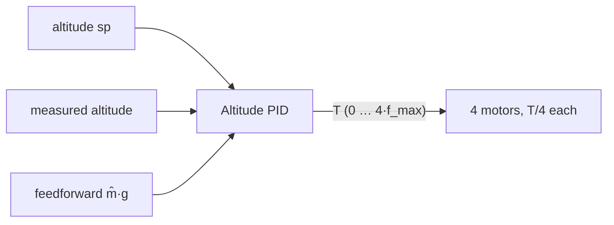
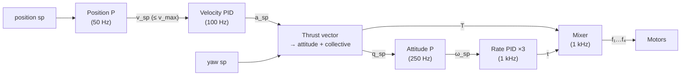

# Control Architecture

How PID controllers are wired to fly the drone at each simulation level
(see [physics-model.md](physics-model.md#2-simulation-levels)). Theory
lives in [pid-primer.md](pid-primer.md).

## 1. The PID building block

A single reusable, framework-free implementation used by every loop. Its
distinguishing feature for this project: **it reports its internals**, so
the UI can plot each term separately.

```ts
type AntiWindup = 'none' | 'clamp' | 'integral-limit' | 'back-calculation';

interface PidConfig {
  kp: number;
  ki: number;
  kd: number;
  derivativeOn: 'error' | 'measurement';
  dFilterHz: number | null;       // null = no filter
  outMin: number;
  outMax: number;
  antiWindup: AntiWindup;
  iLimit?: number;                 // for 'integral-limit'
  kb?: number;                     // for 'back-calculation'
  enabled: { p: boolean; i: boolean; d: boolean }; // per-term toggles for lessons
}

interface PidTerms {
  setpoint: number;
  measurement: number;
  error: number;
  p: number;
  i: number;
  d: number;
  ff: number;          // feedforward passed in by the caller
  unsaturated: number; // p + i + d + ff
  output: number;      // after clamping to [outMin, outMax]
  saturated: boolean;
}

interface Pid {
  update(setpoint: number, measurement: number, dt: number, ff?: number): PidTerms;
  reset(integral?: number): void;   // bumpless re-init support
  readonly last: PidTerms;
  config: PidConfig;                // mutable at runtime
}
```

Implementation notes (all from [pid-primer.md §5](pid-primer.md#5-from-textbook-to-reality-the-digital-pid)):

- Integral stores the already-scaled sum ($\sum K_i e\,\Delta t$) so changing
  $K_i$ mid-flight does not jump the output.
- First call after reset uses $D = 0$ (no previous sample).
- `dt` is passed explicitly — the controller has no notion of wall time.
- Pure and deterministic: no globals, no randomness, trivially unit-testable.

## 2. Level 1 — altitude hold



$$
T = \underbrace{\hat m\, g}_{\text{feedforward (toggle)}} + \text{PID}(y_{sp} - y)
$$

- $\hat m$ is the controller's **belief** about the mass — separately
  adjustable from the true mass $m$. Mismatch ⇒ steady-state error that only
  the I term can fix. (Lesson "Heavier than you think".)
- Output limits = physical thrust range, so saturation and windup are real.
- Default tune (with feedforward): $K_p = 6$, $K_i = 2$, $K_d = 4$
  ($\omega_n \approx 2.4$ rad/s, $\zeta \approx 0.8$ from the PD part alone).
  To be refined in M2.

This single loop is where most lessons live.

## 3. Level 2 — 3D point mass

Three independent copies of the L1 loop, one per world axis:

$$
\vec F = \begin{pmatrix}
\text{PID}_x(x_{sp} - x)\\
\hat m g + \text{PID}_y(y_{sp} - y)\\
\text{PID}_z(z_{sp} - z)
\end{pmatrix}
$$

- Horizontal force limited to $|F_{xz}| \le F_{h,max}$ (default 5 N);
  vertical as in L1.
- Visually the drone tilts in the direction of $\vec F$ (cosmetic only),
  which foreshadows L3.
- Purpose: wind from any direction, compare axes with different gains,
  observe that axes are decoupled here — and that they will **not** be in L3.

## 4. Level 3 — quadrotor cascade

The standard multicopter structure (as in PX4 / ArduPilot, simplified):



### 4.1 Position loop (P, per axis)

$\vec v_{sp} = K_{p,pos}(\vec p_{sp} - \vec p)$, magnitude limited to
$v_{max}$ (horizontal and vertical limits separately). A pure P is enough
here: the inner velocity loop already provides the integral action.

### 4.2 Velocity loop (PID, per axis)

$\vec a_{sp} = \text{PID}_{vel}(\vec v_{sp} - \vec v)$ — the I term here is
what compensates a constant wind.

### 4.3 Thrust vector → attitude setpoint

Desired force in the world frame, with gravity feedforward:

$$
\vec F_{des} = \hat m\,(\vec a_{sp} - \vec g)
$$

- Desired body up-axis: $\hat y_{b,sp} = \vec F_{des} / |\vec F_{des}|$,
  tilt limited to $\theta_{max}$ (default 35°).
- Combined with the yaw setpoint → full attitude setpoint $q_{sp}$.
- Collective thrust $T = \vec F_{des} \cdot \hat y_b$ (projected on the
  **current** body axis, so the drone doesn't climb while it is still
  tilting).

This block is where "to move sideways you must tilt" becomes explicit; the UI
draws $\vec F_{des}$ as an arrow.

### 4.4 Attitude loop (P)

Error quaternion $q_e = q^{-1} \otimes q_{sp}$;
$\vec\omega_{sp} = K_{att} \cdot 2\,\text{sign}(q_{e,w})\,\vec q_{e,xyz}$,
limited to a max rate. Roll/pitch and yaw have separate gains.

### 4.5 Rate loop (PID, per body axis)

$\vec\alpha_{sp} = \text{PID}_{rate}(\vec\omega_{sp} - \vec\omega)$,
then $\vec\tau = I\,\vec\alpha_{sp}$ (inertia as feedforward scaling, so gains
are in physically meaningful units). D on measurement, filtered — the
classic place where noise matters.

### 4.6 Mixer (control allocation)

Inverts the equations from
[physics-model.md §4.3](physics-model.md#43-rotation-l3-only):

$$
\begin{pmatrix}T\\ \tau_x\\ \tau_y\\ \tau_z\end{pmatrix} =
\underbrace{\begin{pmatrix}
1 & 1 & 1 & 1\\
d & -d & -d & d\\
c_\tau & -c_\tau & c_\tau & -c_\tau\\
d & d & -d & -d
\end{pmatrix}}_{A}
\begin{pmatrix}f_1\\ f_2\\ f_3\\ f_4\end{pmatrix}
\quad\Rightarrow\quad \vec f = A^{-1}\,(T, \tau_x, \tau_y, \tau_z)^\top
$$

Saturation handling (visible in the motor bar chart):

1. Compute $\vec f$. If all within $[0, f_{max}]$ → done.
2. Otherwise shift all four by a common offset (trade collective thrust for
   attitude authority).
3. If still out of range, scale down yaw torque first, then roll/pitch.
4. Clamp. Report "mixer saturated" to the telemetry — and to the anti-windup
   of the rate PIDs.

### 4.7 Loop rates and the cascade rule

Defaults: rate 1 kHz, attitude 250 Hz, velocity 100 Hz, position 50 Hz — all
configurable. Each inner loop should be ~5–10× faster (in *bandwidth*, not
just sample rate) than the one around it.

> **Lesson "Cascade inversion"** — make the attitude loop slower than the
> velocity loop and watch the drone wobble and diverge.

## 5. Loop inspector

Every PID instance registers under a stable id
(`alt`, `vel.x`, `rate.roll`, …). The UI lets you pick any registered loop
and shows for it: setpoint vs measurement, error, P/I/D/FF contributions,
output with saturation limits, and editable gains. See
[ui-and-visualization.md](ui-and-visualization.md#live-charts).

## 6. Presets

Named parameter sets, loadable from the UI and used by lessons:
`default`, `p-only`, `pd`, `aggressive`, `sluggish`, `ziegler-nichols`,
`no-feedforward`, `windup-demo`, … Stored as plain JSON so they can be
diffed, shared (URL-encoded) and versioned.
