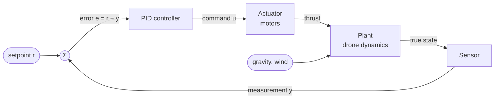

# PID Primer

This document is the theoretical backbone of Anemostatos. Every concept here
should be demonstrable in the simulator; the **Lesson** notes point to the
experiment that shows it (see [ui-and-visualization.md](ui-and-visualization.md#lessons)).

---

## 1. The feedback loop

| Symbol      | Name                           | In Anemostatos (altitude loop)                     |
| ----------- | ------------------------------ | -------------------------------------------------- |
| $r$         | setpoint / reference           | desired altitude, e.g. 2.0 m                       |
| $y$         | process variable / measurement | measured altitude                                  |
| $e = r - y$ | error                          | how far below the target we are                    |
| $u$         | control output / command       | collective thrust command                          |
| $d$         | disturbance                    | wind gusts (gravity is a constant disturbance too) |

The controller never sees the wind. It only sees the error and reacts to it.
That is the whole point of _feedback_: you do not need to model a disturbance
to reject it.

## 2. The ideal (continuous) PID

$$
u(t) = K_p\, e(t) + K_i \int_0^t e(\tau)\, d\tau + K_d \frac{de(t)}{dt}
$$

### P — proportional: "react to where you are"

- Output proportional to the current error. Big error → big push.
- Acts like a **spring** pulling the drone to the setpoint.
- Higher $K_p$ → faster response, but more overshoot and eventually
  oscillation (a spring with no damper oscillates forever).
- **P alone usually leaves a steady-state error** when there is a constant
  load. See §4.

### I — integral: "react to where you have been"

- Accumulates error over time. As long as any error persists, the integral
  keeps growing and so does its push.
- **Eliminates steady-state error**: the only equilibrium is $e = 0$ with
  the integral holding exactly the force needed to cancel the constant load
  (gravity).
- Adds phase lag → makes the loop more oscillatory, slower to settle.
- Source of **windup** (§5.3).

### D — derivative: "react to where you are going"

- Proportional to the rate of change of error, i.e. (for a constant setpoint)
  to the vertical **velocity**.
- Acts like a **damper / shock absorber**: opposes motion, reduces
  overshoot, allows a higher $K_p$.
- Amplifies noise (derivative of noise is large) → needs filtering (§5.2).
- Causes **derivative kick** on setpoint steps (§5.1).

### Mechanical analogy

For the altitude loop the drone is a mass. A PD controller turns it into a
**mass–spring–damper**:

$$
m\ddot{z} = K_p (r - z) - K_d \dot{z} + \text{(gravity, wind, …)}
$$

- $K_p$ = spring stiffness, $K_d$ = damping coefficient.
- Natural frequency $\omega_n = \sqrt{K_p/m}$, damping ratio
  $\zeta = K_d / (2\sqrt{K_p m})$.
- $\zeta < 1$ underdamped (overshoot), $\zeta = 1$ critically damped,
  $\zeta > 1$ overdamped (sluggish).

> **Lesson "Spring and damper"** — P-only oscillates, add D until the
> response is critically damped. The UI shows the live $\omega_n$ and $\zeta$
> computed from the current gains and mass.

## 3. Reading a step response

When the setpoint jumps (e.g. 1 m → 3 m) we measure:

| Metric             | Definition                                                |
| ------------------ | --------------------------------------------------------- |
| Rise time          | time from 10 % to 90 % of the step                        |
| Overshoot          | peak above the setpoint, as % of step size                |
| Settling time      | time after which the output stays within ±2 % of the step |
| Steady-state error | remaining error once everything has settled               |

The simulator computes and displays these automatically after each setpoint
step (see [ui-and-visualization.md](ui-and-visualization.md#step-response-metrics)).

## 4. Why P-only leaves the drone hanging low

In hover, the motors must produce thrust equal to the weight $mg$. With a
pure P controller, thrust comes **only** from the error:

$$
T = K_p\, e \quad\Rightarrow\quad \text{at equilibrium } K_p\, e_{ss} = mg
\quad\Rightarrow\quad e_{ss} = \frac{mg}{K_p}
$$

So the drone settles _below_ the setpoint, by exactly as much as is needed
for the error to "hold it up". Increasing $K_p$ shrinks the droop but never
removes it (and eventually causes oscillation).

Two cures, both available as toggles:

1. **Integral term** — the integral grows until it alone supplies $mg$, and
   $e_{ss} \to 0$.
2. **Feedforward** — add the known hover thrust directly:
   $T = mg + \text{PID}(e)$. Now the controller only has to fight the
   _deviations_. This is what real flight controllers do; the I term then
   only mops up model errors (wrong mass, battery sag, constant wind).

> **Lesson "The gravity droop"** — P-only, no feedforward: observe
> $e_{ss} = mg/K_p$ on the chart, predicted value printed next to it. Then
> enable I, then try feedforward instead.

### 4.1 Why the integral always overshoots here

A surprising but important fact, visible in lesson 5: with an I term, a step
response of the altitude loop **must** overshoot. At steady state the
integral has to hold the same value as before the step (the load has not
changed), so over the whole response

$$
K_i \int_{t_0}^{\infty} e(t)\,dt = 0 .
$$

During the climb the error is positive; to cancel that area it has to spend
some time negative — above the setpoint. Keeping $K_i$ small (and letting
feedforward carry the known load) keeps this overshoot small.

## 5. From textbook to reality: the digital PID

A computer runs the controller at discrete instants $t_k = k\,\Delta t$.
The simplest discretisation:

$$
\begin{aligned}
e_k &= r_k - y_k \\
I_k &= I_{k-1} + K_i\, e_k\, \Delta t \\
D_k &= K_d\, \frac{e_k - e_{k-1}}{\Delta t} \\
u_k &= K_p\, e_k + I_k + D_k
\end{aligned}
$$

Note that $K_i$ is applied _inside_ the integral. That way changing $K_i$
on the fly does not cause a jump in the output (the stored integral is
already scaled).

The controller rate $1/\Delta t$ is a parameter in the simulator
(default 250 Hz, range ~5–1000 Hz).

> **Lesson "Too slow to react"** — lower the controller rate. At some point
> a well-tuned loop becomes oscillatory and then unstable: sampling adds
> delay, and delay eats stability margin.

### 5.1 Derivative kick → derivative on measurement

If the setpoint jumps, $e_k - e_{k-1}$ is huge for one sample, so D produces
a spike ("kick") that can saturate the motors. Since for a constant setpoint
$\dot e = -\dot y$, we can differentiate the **measurement** instead:

$$
D_k = -K_d\, \frac{y_k - y_{k-1}}{\Delta t}
$$

Same damping, no kick. Toggle: _D on error / D on measurement_.

### 5.2 Noise → filtered derivative

Differentiating noisy measurements amplifies the noise. Standard fix: a
first-order low-pass filter on the derivative, with time constant
$T_f$ (often expressed as $N$, where $T_f = K_d/(K_p N)$):

$$
D_k = \alpha\, D_{k-1} + (1-\alpha)\,D_k^{\text{raw}},
\qquad \alpha = \frac{T_f}{T_f + \Delta t}
$$

The filter adds lag, so too much filtering brings back oscillation.
Parameter: _D filter cutoff (Hz)_.

> **Lesson "Noisy sensor"** — enable altimeter noise, watch the D
> contribution chart turn into a hairball and the motors jitter; then
> raise the filtering until it is smooth but the loop still damps well.

### 5.3 Saturation and integrator windup

Motors have limits: thrust $\in [0, T_{max}]$. If the controller asks for
more than is available, the actuator **saturates**. Meanwhile the error
persists, so the integral keeps growing ("winds up"). When the drone finally
reaches the setpoint, the huge integral keeps pushing → big overshoot, long
recovery.

Anti-windup strategies (selectable):

| Strategy                           | Idea                                                                                                   |
| ---------------------------------- | ------------------------------------------------------------------------------------------------------ |
| None                               | For demonstration of the problem.                                                                      |
| Clamping (conditional integration) | Stop integrating while the output is saturated _and_ the error would push further into saturation.     |
| Integral limit                     | Hard clamp on $                                                                                        | I   | $. Simple, crude. |
| Back-calculation                   | Feed the difference between saturated and unsaturated output back into the integrator with gain $K_b$. |

> **Lesson "Windup"** — hold the drone down with a strong downward gust
> (or a large step up with low thrust limit), watch the I term grow on the
> chart, release, observe the overshoot. Repeat with anti-windup on.

### 5.4 Actuator lag

Motors cannot change speed instantly; they behave like a first-order lag with
time constant $\tau_m$ (≈ 20–50 ms for small drones). Lag, like sampling
delay, limits how aggressive the gains can be. Parameter: _motor time
constant_.

### 5.5 Other practical details (implemented, briefly explained in UI)

- **Output limits** on the PID itself (separate from motor limits).
- **Setpoint weighting / ramping** — limit how fast the setpoint moves.
- **Bumpless reset** — resetting or re-enabling the controller without a jump.
- **Integrator reset** button.

## 6. Tuning

### 6.1 Manual (the recommended way to learn)

1. Set $K_i = K_d = 0$ (with feedforward on).
2. Raise $K_p$ until the response is fast but oscillates.
3. Raise $K_d$ until the oscillation is damped.
4. Possibly raise $K_p$ again, then $K_d$ again.
5. Add a small $K_i$ to remove residual error (turn feedforward off or change
   the mass to see why it matters).

### 6.2 Ziegler–Nichols (ultimate gain method)

1. P-only. Increase $K_p$ until the output oscillates with constant
   amplitude. That gain is $K_u$, the oscillation period $T_u$.
2. Classic PID: $K_p = 0.6K_u$, $K_i = 1.2K_u/T_u$, $K_d = 0.075K_uT_u$.

Z–N assumes a plant that is stable on its own (a heater, a tank). A
hovering drone is a **double integrator**: under P alone it oscillates at
_every_ gain (lesson 2), so there is no clean ultimate gain — the recipe does
not apply directly. A good lesson about why heuristics come with
assumptions.

> **Lesson "Find the edge"** — keep $K_d$, raise $K_p$ until motor lag and
> sampling make the loop ring and finally oscillate.

### 6.3 Parallel vs. standard form

We use the **parallel** form ($K_p, K_i, K_d$ independent). Industrial
controllers often use the **standard** form
$u = K_p\,(e + \frac{1}{T_i}\int e + T_d\,\dot e)$. The UI can display the
equivalent $T_i = K_p/K_i$, $T_d = K_d/K_p$.

## 7. Cascaded control (preview)

A drone cannot push itself sideways directly: to move horizontally it must
**tilt**, so that part of the thrust points sideways. That makes horizontal
position a chain of integrators:

attitude rate → attitude → acceleration → velocity → position.

A single PID over such a chain is hard to tune. Instead we nest loops, each
one's output being the next one's setpoint:

Rule of thumb: **each inner loop must be significantly faster (5–10×) than
the loop around it.** Details in
[control-architecture.md](control-architecture.md).

## 8. Glossary

| Term          | Meaning                                                |
| ------------- | ------------------------------------------------------ |
| Plant         | The system being controlled (the drone).               |
| Setpoint      | Target value.                                          |
| Disturbance   | Unmeasured external input (wind).                      |
| Saturation    | Actuator at its limit.                                 |
| Windup        | Integral growing during saturation.                    |
| Feedforward   | Command computed from a model, added to feedback.      |
| Cascade       | Nested loops, outer output = inner setpoint.           |
| Bandwidth     | Roughly: how fast a loop can follow changes.           |
| Settling time | Time until the response stays within a tolerance band. |

## Further reading

- K. J. Åström, R. M. Murray — _Feedback Systems_ (free online), ch. 10–11.
- B. Douglas — _Understanding PID Control_ video series (MathWorks).
- PX4 and Betaflight documentation on multicopter controller structure.
