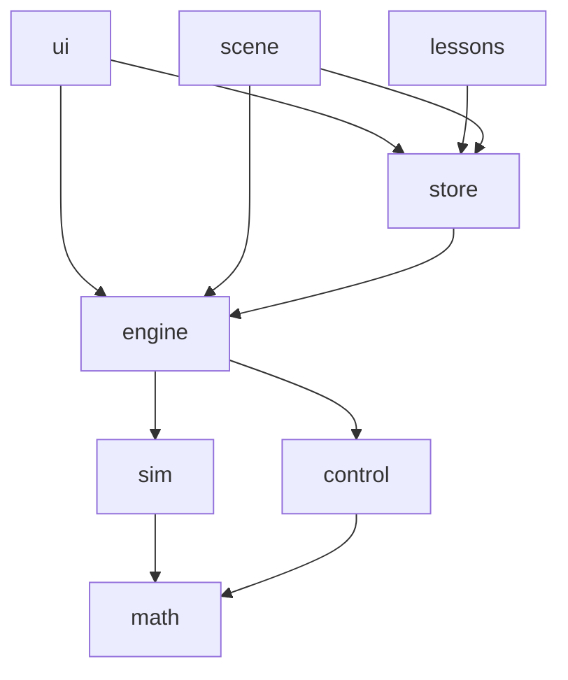

# Software Architecture

## 1. Tech stack

| Concern | Choice | Why |
| --- | --- | --- |
| Language | **TypeScript** (strict) | Types for vectors/units/config catch a lot of physics bugs. |
| Build / dev server | **Vite** | Zero-config, fast HMR, static output. |
| UI framework | **React 19** | Largest ecosystem, and — decisively — home of React Three Fiber, the best way to build a Three.js app declaratively. |
| 3D / WebGL | **Three.js** via **React Three Fiber** (R3F) + **drei** | The scene (drone, grid, arrows, overlays) becomes composable components; drei provides orbit/camera controls, environment lighting, contact shadows, text labels, `Line`, performance helpers. |
| App state | **Zustand** | Tiny store used by both React UI and R3F; supports transient (non-rendering) subscriptions, which matters for 60 fps data. |
| UI components | **shadcn/ui** (Radix primitives) + **Tailwind CSS** | Accessible sliders, toggles, selects, tooltips, tabs, collapsibles; source lives in the repo and is fully restylable. |
| Live charts | **uPlot** (wrapped in a React component) | Canvas-based, built for streaming time series, handles tens of thousands of points at 60 fps. Updated imperatively, never through React state. |
| Math typesetting in lessons | **KaTeX** (`react-katex` / MDX) | Formulas in the in-app explanations. |
| Lesson content | **MDX** | Lessons written as Markdown with embedded components (e.g. a "load preset" button). |
| Tests | **Vitest** | Same config as Vite; physics/control are pure TS. |
| Lint / format | ESLint + Prettier | |
| Running | **Local only**, via `Makefile` | A toy project: no deployment, no CI/CD. `make dev` to run, `make check` before committing. |

Physics and control code **must not import React, Three.js or DOM APIs**.
They use a tiny own vector/quaternion module (`src/math`) so the core can be
tested in Node and potentially moved to a Web Worker.

### The performance rule: React renders structure, not frames

React re-renders are far too expensive to happen 60 times per second for
every signal. Therefore:

- The simulation state lives **outside React** (a plain `Simulation` object
  held by the engine), not in `useState` or the Zustand store.
- 3D objects are updated **by mutating refs inside `useFrame`**
  (`meshRef.current.position.set(...)`), the standard R3F pattern.
- Charts, the live formula and numeric readouts subscribe to telemetry
  **imperatively** and write to canvas / DOM text nodes directly.
- The Zustand store holds only what changes at human speed: parameters,
  selected loop, UI state, lesson progress. Changing a slider re-renders the
  slider, not the scene.

## 2. Module layout

```
src/
  math/          vec3, quat, mat3, PRNG (seeded), filters
  sim/           pure simulation — no DOM, no Three.js
    drone.ts       state, parameters, motor model
    dynamics.ts    equations of motion per level (L1/L2/L3)
    wind.ts        mean + Ornstein–Uhlenbeck + 1−cos gusts
    sensors.ts     noise, bias, delay, sample & hold
    integrator.ts  semi-implicit Euler (interface allows RK4)
    world.ts       ground contact, crash detection, external pokes
  control/       pure control — no DOM, no Three.js
    pid.ts         the PID building block (reports terms)
    altitude.ts    L1 controller
    pointmass.ts   L2 controller
    cascade.ts     L3 cascade: position → velocity → attitude → rate
    mixer.ts       control allocation + desaturation
    registry.ts    named loops for the inspector
  engine/
    simulation.ts  owns sim + controller, fixed-step stepping, loop rates
    telemetry.ts   ring buffers of all signals
    metrics.ts     step-response analysis (rise, overshoot, settling, e_ss)
    params.ts      parameter schema, presets, URL (de)serialisation
  store/         Zustand stores (params, UI state, lesson progress)
  scene/         R3F components
    Scene.tsx      <Canvas>, camera rigs, lights, environment, SimDriver
    Grid.tsx       shader floor grid, axis labels, altitude ruler
    Drone.tsx      procedural drone model (frame, motors, props, LEDs)
    overlays/      ForceArrows, SetpointGhost, Trail, WindParticles
  ui/            React DOM components
    Layout.tsx     panels and responsive layout
    components/    shadcn/ui primitives (slider, switch, select, tooltip…)
    params/        panel generated from the parameter schema
    charts/        uPlot wrappers bound to telemetry
    Inspector.tsx  loop inspector panel
    LiveFormula.tsx
  lessons/       MDX lesson files + lesson runner
  main.tsx       app entry
tests/           unit tests mirroring src/sim, src/control, src/engine
docs/
```

Dependency direction (enforced by lint rule / review):



`sim`, `control`, `math` and `engine` are framework-free TypeScript.

## 3. Simulation loop

Physics must run at a fixed rate independent of the monitor refresh rate and
of rendering hiccups.

The loop is driven by a `<SimDriver>` component inside the R3F `<Canvas>`,
using `useFrame` with a negative priority so the simulation advances before
any scene component reads the new state in the same frame:

```ts
// SimDriver: useFrame((_, delta) => { ... }, -1)
const frameDt = Math.min(delta, 0.1);             // clamp: tab was hidden etc.
accumulator += frameDt * timeScale;               // timeScale: 0 (pause) … 0.1 (slow-mo) … 4
while (accumulator >= PHYS_DT) {
  sim.step(PHYS_DT);                              // controllers run inside, every n-th step
  accumulator -= PHYS_DT;
}
sim.alpha = accumulator / PHYS_DT;               // scene components interpolate prev → current
telemetry.notify();                               // charts/readouts redraw imperatively
```

- `PHYS_DT` = 1 ms. At 1× speed that is ~16 physics steps per 60 Hz frame.
  With L3 this is well under 1 ms of CPU per frame.
- **Controller scheduling:** each loop has its own period expressed as an
  integer multiple of `PHYS_DT`; `sim.step` calls it when due. Output is held
  between calls (zero-order hold).
- **Time controls:** pause, single-step (one controller period), slow motion
  (0.1×, 0.25×, 0.5×), fast-forward (2×, 4×).
- **Safety valve:** if the loop falls behind (> N steps per frame), drop the
  backlog and show a "simulation slowed down" badge rather than freezing.
- **Web Worker:** not needed initially. Because `sim` and `control` are pure,
  moving them to a worker later is a mechanical change.

## 4. State, parameters and presets

- **One parameter tree** (`params.ts`) describes every tunable value with
  metadata: label, unit, min, max, step, default, group, description (short
  educational text shown in a tooltip).
- The UI panel is **generated from this schema**, so adding a parameter is a
  one-line change.
- Parameters are **live**: changes apply at the next simulation step, no
  reset required (except simulation level and seed).
- Current parameters serialise into the URL hash → any experiment is a
  shareable link. Presets are the same JSON.

## 5. Telemetry

- Every simulation step can publish named scalar signals
  (`alt.error`, `alt.p`, `alt.i`, `wind.x`, `motor.1`, …).
- Stored in fixed-size **ring buffers** (typed arrays), recorded at a
  telemetry rate (default 200 Hz) with a history of 60 s.
- Charts read from the buffers at display rate (≤ 60 Hz); they never touch
  the simulation directly.
- **Export**: CSV download of the current buffers for offline analysis
  (e.g. in a notebook).
- **Freeze & compare**: snapshot a run as a "ghost" trace and overlay it on
  subsequent runs — critical for comparing tunings on the same seeded wind.

## 6. Testing strategy

| Area | Tests |
| --- | --- |
| `math` | quaternion ops, rotations, normalisation, PRNG determinism. |
| `pid` | each term in isolation, derivative on measurement (no kick), filter step response, each anti-windup mode, bumpless gain change, reset. |
| `sim` | free fall matches $\frac12 g t^2$; hover equilibrium with $T = mg$; motor lag time constant; drag terminal velocity; torque sign conventions; OU process mean/variance statistics; gust profile shape. |
| `control` | L1 closed loop reaches setpoint with $e_{ss} \approx 0$ with I; P-only $e_{ss} \approx mg/K_p$ (the theory check!); mixer round-trip $A^{-1}A = I$; L3 hover and step converge. |
| `engine` | same seed ⇒ bit-identical trajectories; step metrics on synthetic signals. |

The UI and rendering are verified manually / via screenshots; they contain no
logic worth unit-testing if the split above is respected.

## 7. Performance budget

- 60 fps on a mid-range laptop with all charts visible.
- Physics + control: < 2 ms per frame at 1× speed (L3).
- Charts: uPlot `setData` on at most ~6 visible charts per frame, each with
  ≤ ~3 000 points (decimated from the ring buffer when zoomed out).
